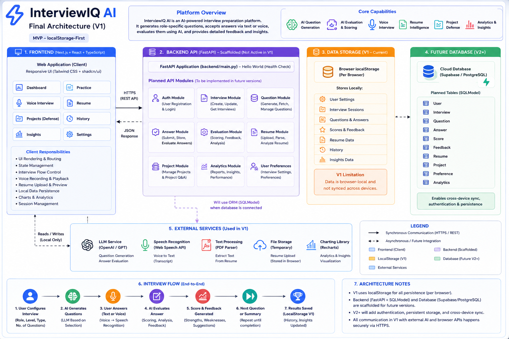

# InterviewIQ AI

> **AI-powered interview intelligence for deliberate practice.**

[](https://ai-mock-interview-pj03qbplx-kalyan870s-projects.vercel.app)

InterviewIQ AI is a full-stack mock-interview platform that conducts a role-specific interview one question at a time, evaluates every answer, adapts difficulty, and produces an actionable readiness report.

**[Open the live application →](https://ai-mock-interview-pj03qbplx-kalyan870s-projects.vercel.app)**

## What it delivers

- Role, experience-level, interview-mode, and question-count configuration
- Technical, Coding, System Design, Generative AI, HR / Behavioral, and Mixed modes
- Adaptive interview flow: answer → evaluation → knowledge-gap detection → difficulty decision → next question
- Structured answer evaluation across correctness, relevance, completeness, clarity, and technical depth
- Interview readiness report with strengths, improvement areas, and recommended practice topics
- Resume Intelligence: validated PDF upload and text extraction for contextual questions
- Project-defense-ready interview configuration
- Responsive InterviewIQ dashboard with readiness score and progress visualisation

## Complete interview intelligence workflow

```text
Candidate profile + target role + experience + interview mode
                         ↓
                 AI Interview Engine
                         ↓
               Role-specific question
                         ↓
                Candidate response
                         ↓
      Structured evaluation and gap detection
                         ↓
       Difficulty decision + contextual follow-up
                         ↓
      Next question or Interview Intelligence Report
```

The engine maintains the interview context rather than treating each answer as an isolated chat message. Strong answers can increase difficulty; partial answers retain the level; weak or incomplete answers can produce a foundational follow-up.

## Interview modes

| Mode | Interview focus |
| --- | --- |
| Technical | Core concepts, implementation, APIs, reliability, and role knowledge |
| Coding | Algorithms, data structures, complexity, edge cases, and explanation |
| System Design | Architecture, scalability, availability, data flow, and trade-offs |
| Generative AI | LLMs, RAG, evaluation, AI agents, safety, latency, and cost |
| HR / Behavioral | Communication, impact, decision-making, and experience stories |
| Mixed | A realistic blend of technical and behavioral questions |
| Resume-led | Questions grounded in extracted resume context |
| Project Defense | Architecture, technology choices, security, scaling, failures, deployment, and cost of a selected project |

## Answer evaluation

Every response is evaluated as structured data rather than a plain text comment.

| Dimension | Weight |
| --- | ---: |
| Correctness | 30% |
| Relevance | 20% |
| Completeness | 20% |
| Clarity | 15% |
| Technical depth | 15% |

The report includes a 0–10 answer score, detailed feedback, strengths, missing concepts, a stronger model answer, a difficulty decision, and targeted study recommendations. The final readiness report groups results into technical knowledge, communication, and problem-solving signals.

## Resume Intelligence

Candidates can upload a PDF resume. The FastAPI service validates file type and size, extracts text with PyMuPDF, and passes only relevant profile context to the interview engine. This makes it possible to ask meaningful follow-ups such as:

> “Explain the retrieval pipeline you implemented in your RAG project. Why was that vector-search approach appropriate?”

Production storage should keep uploaded files private, associate metadata with the authenticated user, and never write resume content or API keys to logs.

## Dashboard, history, and personalised learning

The InterviewIQ dashboard is designed around a clear Interview Readiness Score and category-level signals. Its learning loop is:

```text
Practice → Evaluate → Detect weaknesses → Recommend topics → Practice again → Measure progress
```

The UI already presents readiness, recent performance, and recommended practice. Durable history, per-topic trends, cross-device sync, and authenticated user analytics are the next persistence phase.

## Product capability status

| Capability | Status |
| --- | --- |
| Configurable adaptive text interview | Available |
| AI structured evaluation with server-side OpenAI key | Available when `OPENAI_API_KEY` is configured |
| Role-aware local demo experience | Available without an API key |
| Resume PDF validation and text extraction | Available |
| Resume-led and project-defense question configuration | Available |
| Final readiness report and print-to-PDF export | Available |
| Supabase schema and row-level-security migration | Included; connection is a deployment step |
| Supabase Auth, account settings, and protected routes | Planned integration |
| Persistent interview history and cross-device analytics | Planned integration |
| Voice transcription / speech recognition | Planned integration |
| Sandboxed executable coding submissions | Planned integration — never run arbitrary code in the main API service |
| LangGraph state orchestration | Planned integration |

## Security and privacy

- OpenAI and Supabase service keys are server-only environment variables.
- Client requests are validated with Pydantic models.
- Resume uploads accept PDFs only and enforce a 5 MB limit.
- CORS is configured through the `ALLOWED_ORIGINS` environment variable.
- Supabase migration enables row-level security to keep future persisted data scoped to the authenticated owner.
- A future coding runtime must be isolated in a dedicated sandbox with strict resource and network restrictions.

## Who it is for

InterviewIQ AI is for students, fresh graduates, software engineers, AI/ML and GenAI developers, backend and full-stack developers, and anyone preparing for technical, behavioral, or project-defense interviews.

## Application Architecture

The application keeps browser presentation, backend orchestration, AI evaluation, and persisted data responsibilities separate. The diagram below captures the wider product architecture and planned production integrations.


## Final Architecture

The current implementation uses a Next.js frontend and FastAPI API, with a secure server-side OpenAI integration point and Supabase schema prepared for production persistence and authentication. When no OpenAI key is present, the service intentionally runs in a local demo mode so the full interview experience remains runnable.



## Technology

| Layer | Technology |
| --- | --- |
| Frontend | Next.js, React, TypeScript, Tailwind CSS |
| API | Python, FastAPI, Pydantic |
| AI | OpenAI structured JSON output with a deterministic local fallback |
| Resume parsing | PyMuPDF |
| Data model | PostgreSQL / Supabase migration with row-level security |
| Deployment | Vercel |

## Repository structure

```text
frontend/     Next.js application and InterviewIQ dashboard
backend/      FastAPI service, interview engine, resume parser, API tests
supabase/     Supabase/PostgreSQL schema and RLS policies
docs/         deployment notes and architecture visuals
```

## Run locally

1. Copy `.env.example` to `frontend/.env.local` and `backend/.env`.
2. Start the API:

   ```powershell
   cd backend
   python -m venv .venv
   .\.venv\Scripts\Activate.ps1
   pip install -r requirements.txt
   uvicorn app.main:app --reload
   ```

3. Start the frontend in another terminal:

   ```powershell
   cd frontend
   npm install
   npm run dev
   ```

Visit `http://localhost:3000`.

## Environment variables

Never expose server secrets in the browser. Use the provided `.env.example` files:

```env
# frontend/.env.local
NEXT_PUBLIC_API_URL=http://localhost:8000

# backend/.env
OPENAI_API_KEY=
OPENAI_MODEL=gpt-4.1-mini
SUPABASE_URL=
SUPABASE_SERVICE_ROLE_KEY=
ALLOWED_ORIGINS=http://localhost:3000
```

## Deployment

- Frontend: Vercel
- FastAPI API: Vercel serverless deployment or Render/Railway
- Production data/auth: Supabase

See [deployment notes](docs/DEPLOYMENT.md) and the [Supabase migration](supabase/migrations/001_initial_schema.sql).

## Roadmap

- Supabase Auth connected to protected API routes
- Database-backed interview history and cross-device analytics
- LangGraph interview-state orchestration
- Safe sandbox service for executable coding assessments
- Voice transcription and downloadable report exports

## License

This project is available under the [MIT License](LICENSE).
