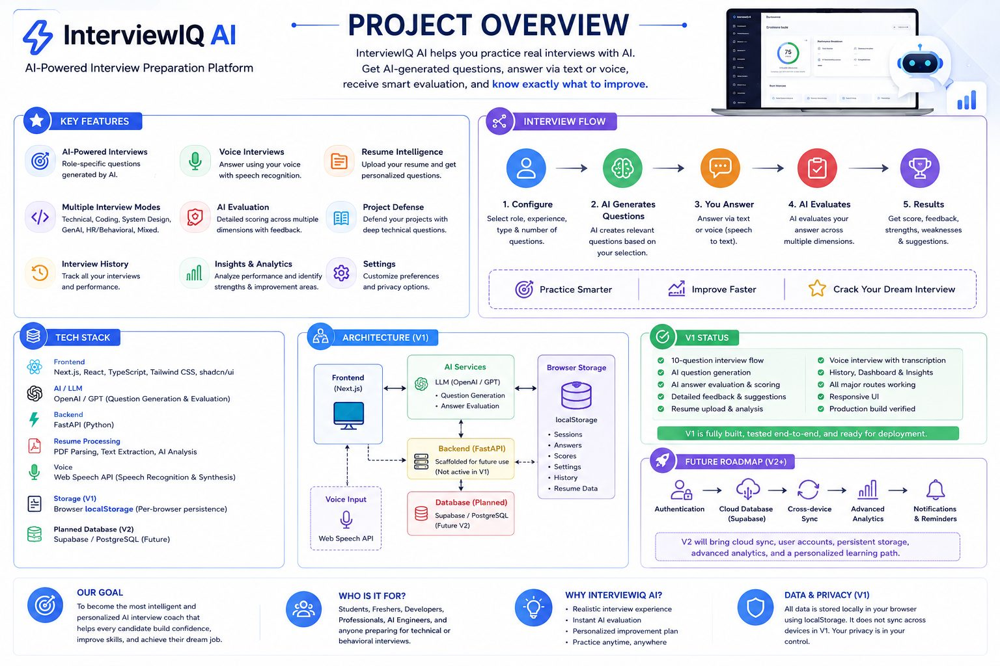
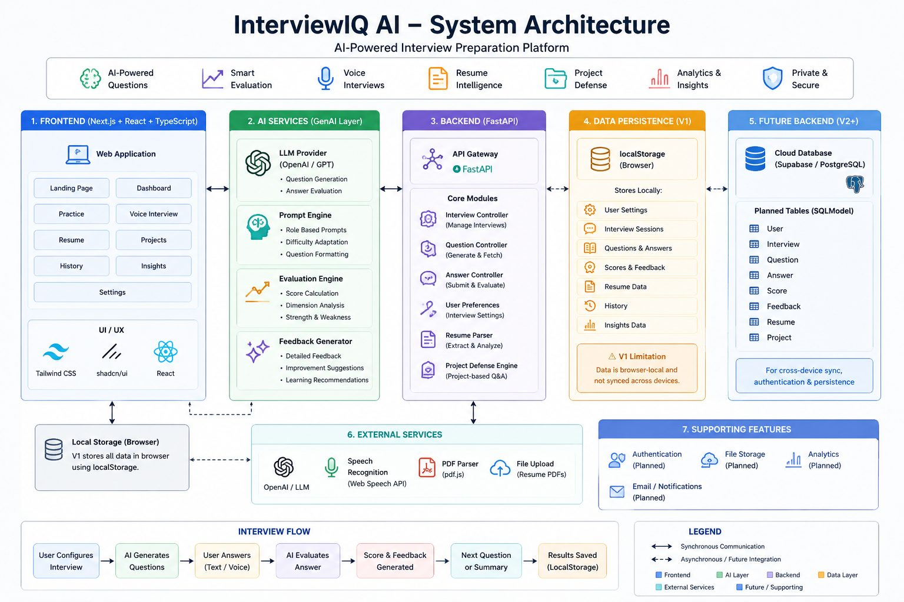
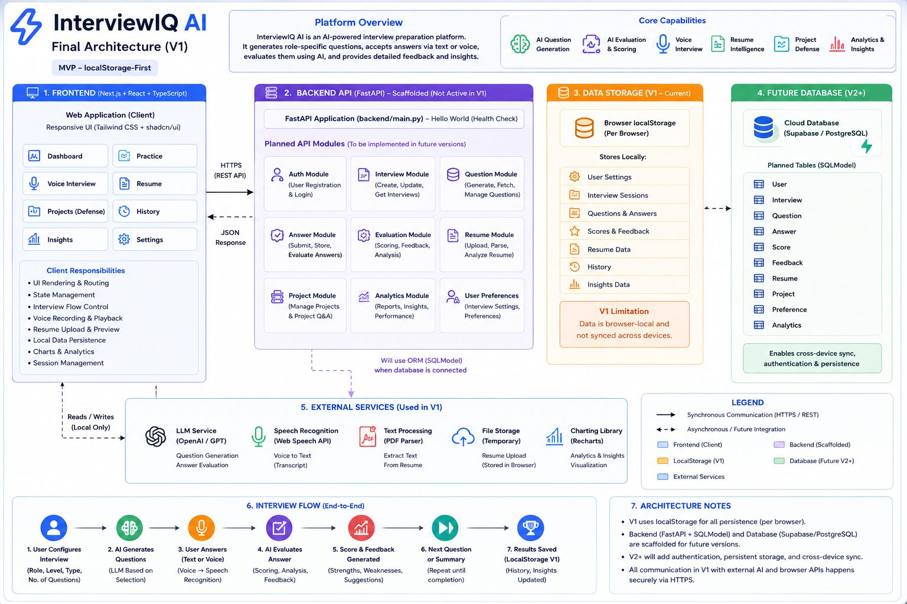

# InterviewIQ AI

AI-Powered Interview Preparation, Evaluation & Personalized Coaching Platform

InterviewIQ AI is a full-stack AI interview preparation platform designed to simulate realistic technical and behavioral interviews, generate role-specific questions, evaluate candidate answers, provide detailed feedback, analyze resumes, conduct voice-based interviews, defend projects, and track performance through personalized insights.

The platform combines AI, full-stack development, authentication, persistent data, voice interaction, resume intelligence, and analytics into a single production-oriented application.

## Project Overview



InterviewIQ AI provides an end-to-end interview preparation experience that helps candidates practice, evaluate, and improve their interview performance.

## Core Capabilities

### AI-Powered Interview Generation
- Role-specific interview questions
- Experience-level customization
- Technical interviews
- Coding interviews
- System Design interviews
- Generative AI interviews
- HR / Behavioral interviews
- Mixed interviews

### AI-Powered Answer Evaluation
- Dynamic scoring
- Detailed feedback
- Strength and weakness analysis
- Actionable improvement recommendations

### Voice Interviews
- Speech recognition

### Resume Upload and Analysis
- Resume-based personalized questions

### Project Defense Interviews

### Interview History

### Performance Dashboard

### AI Insights

### User Authentication

### Persistent Database Storage

### Cross-Device Synchronization

### Guest/Local Storage Support

## Key Features

### AI-Powered Interviews

Users can configure interviews according to their specific preparation requirements.

Interview configuration includes:
- Target role
- Experience level
- Interview type
- Number of questions

The AI then generates questions based on the selected configuration.

#### Multiple Interview Modes

| Interview Mode | Purpose |
|----------------|---------|
| Technical | Core technical knowledge and fundamentals |
| Coding | Programming and problem-solving |
| System Design | Architecture, scalability, and design |
| Generative AI | LLMs, RAG, AI agents, and GenAI systems |
| HR / Behavioral | Communication and behavioral preparation |
| Mixed | Combined interview simulation |

### Adaptive Interview Experience

InterviewIQ AI is designed to provide a more realistic interview experience instead of simply displaying a static list of questions.

The interview workflow is:

```
Interview Configuration
        ↓
AI Question Generation
        ↓
Candidate Answer
        ↓
AI Evaluation
        ↓
Score + Feedback
        ↓
Next Question
        ↓
Continue Interview
        ↓
Final Evaluation
```

Questions can be tailored according to:
- Target role
- Experience level
- Interview category
- Candidate responses
- Interview context

### AI Answer Evaluation

InterviewIQ AI evaluates answers based on their actual content.

The evaluation can assess:
- Technical knowledge
- Communication
- Problem solving
- AI knowledge
- Completeness
- Relevance
- Clarity
- Technical depth

**Evaluation output:**

```
Candidate Answer
       ↓
AI Analysis
       ↓
Performance Score
       ↓
Strengths
       ↓
Weaknesses
       ↓
Improvement Suggestions
```

The system generates scores and feedback from the candidate's response rather than relying on fixed demonstration scores.

### Voice Interview

InterviewIQ AI supports voice-based interview practice using browser speech recognition.

**Voice workflow:**

```
AI Interview Question
        ↓
Candidate Speaks
        ↓
Speech Recognition
        ↓
Transcript
        ↓
Review / Edit
        ↓
Submit Answer
        ↓
AI Evaluation
```

**Voice capabilities:**
- Microphone permission
- Speech recognition
- Transcript generation
- Transcript display
- Answer editing
- Voice answer submission
- Question replay

This allows candidates to practice communication and verbal delivery in addition to technical knowledge.

### Resume Intelligence

Users can upload a PDF resume and use it to generate more personalized interview preparation.

**Resume workflow:**

```
Resume PDF
    ↓
PDF Text Extraction
    ↓
Resume Analysis
    ↓
Skills / Experience / Projects
    ↓
Personalized Questions
```

Questions can be generated around information contained in the candidate's resume, helping prepare for resume-based interview discussions.

### Project Defense

Project Defense allows candidates to practice explaining their own projects under technical questioning.

Example project categories include:
- RAG Resume Assistant
- AI Interview Coach
- Document Q&A System

Project Defense can focus on:
- Architecture
- Technology choices
- Implementation
- AI components
- Data flow
- Design decisions
- Trade-offs
- Challenges
- Scalability
- Security
- Performance
- Deployment
- Limitations
- Future improvements

The objective is to prepare candidates for questions such as:
- Why did you choose this technology?
- How does your architecture work?
- What would happen if the system had to scale?
- What were the main technical challenges?

### Dashboard

The Dashboard provides a centralized overview of interview preparation.

**Dashboard includes:**
- Interview readiness
- Performance breakdown
  - Technical Knowledge
  - Communication
  - Problem Solving
  - AI Knowledge
  - Completeness
- Recent interviews
- Quick actions
  - Practice access
  - Resume access
  - Project Defense access

### Interview History

Completed interview sessions can be stored and retrieved for future review.

Interview records can contain:
- Interview configuration
- Questions
- Answers
- Scores
- Feedback
- Session information
- Interview metadata

Authenticated users can retrieve their persistent interview history through the backend API.

### Performance Insights

The Insights section analyzes interview performance and helps identify areas that require additional practice.

**Performance dimensions include:**
- Technical Knowledge
- Communication
- Problem Solving
- AI Knowledge
- Completeness

The architecture also provides a foundation for expanding analytics into long-term skill progression and personalized learning.

### Authentication

The application includes user authentication for persistent personalized experiences.

**Authentication technology:**
- JWT
- HS256
- bcrypt
- Bearer authentication
- 7-day tokens

**Authentication flow:**

```
Register
   ↓
Create Account
   ↓
Login
   ↓
JWT Token
   ↓
Authenticated API Requests
   ↓
Persistent User Data
```

**Authentication endpoints:**
- `POST /api/auth/register`
- `POST /api/auth/login`
- `GET  /api/auth/me`

The frontend authentication context manages authentication state, token handling, refresh behavior, and logout.

## Application Architecture



InterviewIQ AI follows a full-stack client-server architecture.

```
                         USER
                           │
                           ▼
                ┌────────────────────┐
                │   Next.js Frontend │
                │ React + TypeScript │
                │ Tailwind + UI      │
                └─────────┬──────────┘
                          │
                       REST API
                          │
                          ▼
                ┌────────────────────┐
                │   FastAPI Backend  │
                │      Python        │
                └─────────┬──────────┘
                          │
          ┌───────────────┼────────────────┐
          │               │                │
          ▼               ▼                ▼
     Authentication   Interviews        Resume
     JWT + bcrypt     Q+A + Feedback   User Data
          │               │                │
          └───────────────┼────────────────┘
                          ▼
                  ┌──────────────┐
                  │   SQLModel   │
                  └──────┬───────┘
                         │
                         ▼
                 SQLite / PostgreSQL
```

## Final Architecture



```
                              INTERVIEWIQ AI
                                    │
             ┌──────────────────────┴──────────────────────┐
             │                                             │
             ▼                                             ▼
     ┌─────────────────┐                          ┌─────────────────┐
     │     Frontend    │                          │     Backend     │
     │     Next.js     │◄────── REST / JWT ─────►│     FastAPI     │
     └────────┬────────┘                          └────────┬────────┘
              │                                            │
      ┌───────┼────────────────┐              ┌────────────┼────────────┐
      │       │                │              │            │            │
      ▼       ▼                ▼              ▼            ▼            ▼
 Dashboard  Practice      Voice Interview   Auth       Interviews     Resume
      │       │                │              │            │            │
      └───────┼────────────────┘              └────────────┼────────────┘
              │                                            │
              ▼                                            ▼
       AI Interview Engine                         SQLModel Database
              │                                            │
      ┌───────┼────────┐                           ┌───────┴────────┐
      ▼       ▼        ▼                           ▼                ▼
 Questions Evaluation Feedback                 SQLite          PostgreSQL
      │       │        │                                      / Supabase
      └───────┼────────┘
              │
              ▼
       Dashboard / History
           / Insights
```

## Backend Architecture

The backend is implemented using FastAPI and provides authenticated API services.

**Backend structure:**
```
backend/
│
├── main.py
├── database.py
├── auth.py
├── requirements.txt
│
└── routers/
    ├── auth.py
    ├── interviews.py
    └── resume.py
```

### Backend API

**Authentication:**
- `POST /api/auth/register`
- `POST /api/auth/login`
- `GET  /api/auth/me`

**Interviews:**
- `POST /api/interviews`
- `GET  /api/interviews`
- `GET  /api/interviews/:id`

**Resume:**
- `GET  /api/resume`
- `PUT  /api/resume`

**Health:** The backend also provides a health-check endpoint for service verification.

## Database Architecture

The persistence layer uses SQLModel.

**Main entities:**
```
User
 │
 ├── Interviews
 │      ├── Questions
 │      ├── Answers
 │      └── Feedback
 │
 └── Resume
```

The database connection is configurable through:
```
DATABASE_URL=<database-url>
```

The development configuration can use SQLite, while the architecture supports PostgreSQL/Supabase deployment.

## Data Persistence

The application supports both guest and authenticated experiences.

### Guest Experience

Users without an authenticated account can use local browser persistence.

```
Guest User
     ↓
localStorage
```

This maintains a lightweight local-first experience.

### Authenticated Experience

Authenticated users use the backend for persistent data.

```
Authenticated User
        ↓
Next.js
        ↓
JWT Authentication
        ↓
FastAPI
        ↓
SQLModel
        ↓
Database
```

### Dual Persistence

The application maintains compatibility between local and server-backed storage.

For authenticated sessions:

```
                    saveSession()
                         │
                ┌────────┴────────┐
                │                 │
                ▼                 ▼
          localStorage       FastAPI API
                                  │
                                  ▼
                             SQLModel
                                  │
                                  ▼
                              Database
```

This provides:
- Local fallback
- Persistent server storage
- V1 local compatibility
- Authenticated synchronization

### Cross-Device Synchronization

Authenticated user data can be accessed from multiple browsers or devices through the user's account.

```
                 USER ACCOUNT
                      │
                      ▼
                  DATABASE
                 /        \
                /          \
               ▼            ▼
           Laptop        Desktop
               │            │
               └──── Same ──┘
                    Data
```

This allows interview history and other persisted user information to move beyond a single browser.

## Technology Stack

### Frontend
- Next.js
- React
- TypeScript
- Tailwind CSS
- UI
  - shadcn/ui
  - Responsive component architecture

### Backend
- Python
- FastAPI
- SQLModel
- Authentication
  - JWT
  - HS256
  - bcrypt
  - Bearer authentication

### AI
- OpenAI / GPT-based AI services
- AI question generation
- AI answer evaluation
- AI feedback generation

### Voice
- Web Speech API
- Speech recognition

### Resume
- PDF upload
- PDF text extraction
- Resume analysis
- Personalized question generation

### Database
- SQLModel
- SQLite for development
- PostgreSQL/Supabase-ready architecture

### Storage
- localStorage for guest/local fallback
- Database persistence for authenticated users

### Deployment
- Vercel for frontend
- FastAPI-compatible backend hosting
- PostgreSQL/Supabase-compatible database

## Project Structure

```
InterviewIQ-AI/
│
├── app/
│   ├── auth/
│   │   ├── login/
│   │   │   └── page.tsx
│   │   └── register/
│   │       └── page.tsx
│   │
│   ├── dashboard/
│   ├── practice/
│   ├── voice-interview/
│   ├── resume/
│   ├── projects/
│   ├── history/
│   ├── insights/
│   ├── settings/
│   │
│   ├── components/
│   │   ├── TopBar.tsx
│   │   └── ...
│   │
│   └── lib/
│       ├── api.ts
│       ├── auth.tsx
│       └── store.ts
│
├── backend/
│   ├── main.py
│   ├── database.py
│   ├── auth.py
│   ├── requirements.txt
│   │
│   └── routers/
│       ├── auth.py
│       ├── interviews.py
│       └── resume.py
│
├── public/
├── package.json
└── README.md
```

## Installation

### Prerequisites
- Node.js
- npm
- Python
- Git

### Clone Repository

```bash
git clone <YOUR_GITHUB_REPOSITORY_URL>
cd InterviewIQ-AI
```

### Install Frontend Dependencies

```bash
npm install
```

### Install Backend Dependencies

```bash
cd backend
pip install -r requirements.txt
```

### Environment Variables

**Frontend**

Create `.env.local`:

```env
NEXT_PUBLIC_API_URL=http://localhost:8000
```

For production:

```env
NEXT_PUBLIC_API_URL=https://your-production-api.example.com
```

**Backend:**

```env
DATABASE_URL=sqlite:///./interviewiq.db
SECRET_KEY=your-development-secret
```

For production:

```env
DATABASE_URL=<production-database-url>
SECRET_KEY=<strong-production-secret>
```

> ⚠️ Never commit production secrets to GitHub.

### Running Locally

**Start Backend:**

```bash
cd backend
uvicorn main:app --reload
```

- Backend: http://localhost:8000
- Swagger documentation: http://localhost:8000/docs

**Start Frontend:**

From the project root:

```bash
npm run dev
```

- Frontend: http://localhost:3000

### Production Build

Build the frontend:

```bash
npm run build
```

Start production server:

```bash
npm start
```

## Deployment

### Frontend

The Next.js application can be deployed to Vercel.

```bash
npx vercel --prod
```

Configure the production API URL in Vercel:

```env
NEXT_PUBLIC_API_URL=<production-api-url>
```

### Backend

Deploy the FastAPI backend to a production-compatible hosting service.

Configure:

```env
DATABASE_URL=<production-database-url>
SECRET_KEY=<strong-production-secret>
```

The backend must be publicly accessible to the deployed frontend.

### Production Validation

After deployment, validate the complete production workflow:

```
Production Website
       ↓
Register
       ↓
Login
       ↓
Start Interview
       ↓
Configure Interview
       ↓
Complete 10 Questions
       ↓
AI Evaluation
       ↓
Final Score
       ↓
History
       ↓
Dashboard
       ↓
Insights
       ↓
Logout
       ↓
Login From Another Browser / Device
       ↓
Verify Persistent Data
```

Also verify:
- ✅ Resume upload
- ✅ Resume analysis
- ✅ Voice interview
- ✅ Project Defense
- ✅ Authentication
- ✅ API connectivity
- ✅ Responsive layouts

## Testing & Validation

The application has been tested across its major workflows.

### Interview
- ✅ Start interview
- ✅ Configure target role
- ✅ Configure experience level
- ✅ Configure interview type
- ✅ Configure question count
- ✅ Generate questions
- ✅ Submit answers
- ✅ Generate next question
- ✅ Complete interview
- ✅ Generate score
- ✅ Generate detailed evaluation
- ✅ Store interview
- ✅ Update History
- ✅ Update Dashboard
- ✅ Update Insights

### AI
- ✅ Technical questions
- ✅ Generative AI questions
- ✅ System Design questions
- ✅ HR questions
- ✅ Answer evaluation
- ✅ Content-based scoring
- ✅ Strength analysis
- ✅ Weakness analysis
- ✅ Feedback generation

### Resume
- ✅ PDF upload
- ✅ PDF extraction
- ✅ Resume analysis
- ✅ Personalized questions

### Voice
- ✅ Microphone permission
- ✅ Speech recognition
- ✅ Transcript generation
- ✅ Transcript display
- ✅ Question replay
- ✅ Voice answer submission

### Authentication
- ✅ Registration
- ✅ Login
- ✅ JWT authentication
- ✅ Authenticated API requests
- ✅ Logout
- ✅ Current-user API

### Backend
- ✅ FastAPI
- ✅ CORS
- ✅ Authentication routes
- ✅ Interview routes
- ✅ Resume routes
- ✅ SQLModel
- ✅ Database configuration
- ✅ Backend smoke testing

### Build
- ✅ Production build
- ✅ Application routes
- ✅ Authentication routes
- ✅ Frontend/backend integration

## Security & Privacy

InterviewIQ AI uses authentication and server-side persistence for authenticated users.

Security considerations include:
- JWT authentication
- bcrypt password hashing
- Bearer-token API authentication
- Environment-variable configuration
- Production secret management
- CORS configuration
- File upload validation
- File size controls
- No committed production secrets

### Privacy

- Guest data can remain browser-local.
- Authenticated user data is associated with the user's account and persisted through the backend/database architecture.
- Production deployments should use HTTPS and properly secured database credentials.

## Performance & Reliability

The application is designed around separated frontend and backend responsibilities.

**Frontend** is responsible for:
- User interface
- Navigation
- Interview state
- Answer collection
- Voice interaction
- Resume interaction
- Dashboard presentation

**Backend** is responsible for:
- Authentication
- User-specific data
- Interview persistence
- Resume persistence
- API access
- Database interaction

This separation allows the application to scale beyond a browser-only architecture.

## Project Workflow

```
                    USER
                      │
                      ▼
              Configure Interview
                      │
                      ▼
              AI Question Engine
                      │
                      ▼
                Ask Question
                      │
              ┌───────┴───────┐
              ▼               ▼
           Text             Voice
              │               │
              └───────┬───────┘
                      ▼
                 User Answer
                      │
                      ▼
                AI Evaluation
                      │
          ┌───────────┼───────────┐
          ▼           ▼           ▼
        Score      Strengths   Weaknesses
          │           │           │
          └───────────┼───────────┘
                      ▼
              Improvement Plan
                      │
                      ▼
                Next Question
                      │
                      ▼
              Complete Interview
                      │
                      ▼
          History / Dashboard / Insights
```

## Why InterviewIQ AI?

Traditional interview preparation often depends on:
- Static question lists
- Generic answers
- Self-evaluation
- Manual progress tracking
- Limited personalization

InterviewIQ AI combines these capabilities into one platform.

```
AI Question Generation
          +
AI Answer Evaluation
          +
Adaptive Interviews
          +
Voice Interaction
          +
Resume Intelligence
          +
Project Defense
          +
Performance Analytics
          +
Authentication
          +
Persistent Data
          +
Cross-Device Synchronization
          =
       InterviewIQ AI
```

## Target Users

InterviewIQ AI is designed for:
- Students
- Fresh graduates
- Software developers
- AI Engineers
- ML Engineers
- GenAI developers
- Backend developers
- Frontend developers
- Full-stack developers
- Candidates preparing for technical interviews
- Candidates preparing for behavioral interviews
- Candidates preparing for AI/ML interviews

## Product Vision

The long-term goal is to evolve InterviewIQ AI into a personalized AI interview coach that understands each candidate's:
- Skills
- Experience
- Resume
- Projects
- Interview history
- Strengths
- Weaknesses
- Performance trends

and continuously adapts preparation to the candidate.

```
Practice
   ↓
Evaluate
   ↓
Identify Weaknesses
   ↓
Personalize
   ↓
Practice Again
   ↓
Improve
```

## Roadmap

Future improvements can include:

### Advanced AI
- More adaptive interview behavior
- Dynamic difficulty adjustment
- Multi-turn technical discussions
- Job-description-based interviews
- Company-specific interview preparation
- More advanced answer evaluation
- Personalized learning paths

### Analytics
- Long-term performance trends
- Skill progression
- Topic-level weakness analysis
- Interview readiness prediction
- Historical score comparison
- Personalized recommendations

### Platform
- Multiple resume management
- Saved job descriptions
- Advanced Project Defense
- Interview reports
- Downloadable performance reports
- Notifications
- More advanced voice interaction
- Expanded user profiles

## Project Status

InterviewIQ AI is a full-stack AI interview preparation platform.

**Current platform capabilities include:**

| Feature | Status |
|---------|--------|
| AI Interviews | ✓ |
| AI Evaluation | ✓ |
| Voice Interviews | ✓ |
| Resume Intelligence | ✓ |
| Project Defense | ✓ |
| Dashboard | ✓ |
| History | ✓ |
| Insights | ✓ |
| Authentication | ✓ |
| FastAPI Backend | ✓ |
| SQLModel | ✓ |
| Persistent Data | ✓ |
| Cross-Device Foundation | ✓ |
| Production Deployment | ✓ |

## Future Architecture

The architecture is designed to support further expansion:

```
                    InterviewIQ AI
                           │
                    Next.js Frontend
                           │
                      REST / JWT
                           │
                    FastAPI Backend
                           │
          ┌────────────────┼────────────────┐
          │                │                │
        Auth          AI Services       Data APIs
          │                │                │
          └────────────────┼────────────────┘
                           │
                        SQLModel
                           │
                           ▼
                  PostgreSQL / Supabase
                           │
              ┌────────────┼────────────┐
              ▼            ▼            ▼
           Users       Interviews     Resumes
                           │
                           ▼
                     Analytics
                           │
                           ▼
                 Personalized AI Coach
```

## Conclusion

InterviewIQ AI is a full-stack AI-powered interview preparation platform combining:
- AI-generated interviews
- Technical and behavioral preparation
- AI answer evaluation
- Detailed performance feedback
- Voice interviewing
- Resume intelligence
- Project Defense
- Performance analytics
- User authentication
- FastAPI backend
- SQLModel persistence
- Cross-device data synchronization

The platform is designed around a single objective:

> Help candidates practice realistic interviews, understand their weaknesses, and continuously improve their interview performance through AI-powered feedback.

## Live Demo

🚀 **Experience the live application:** [InterviewIQ AI](https://ai-mock-interview-pj03qbplx-kalyan870s-projects.vercel.app/)

## Author

**Kalyan**

Computer Science Student | AI Engineering | Generative AI | LLMs | AI Agents | Full-Stack Development

## License

[MIT License](LICENSE)
